# YatırımZekası: AI Destekli Portföy Takip Sistemi

**Borsa yatırımlarınızı takip edin, analiz edin, risklerinizi yönetin ve yapay zekâ asistanınızla yatırımlarınızı yorumlayın.**

Bu proje, **Yapay Zeka ve Teknoloji Akademisi (YZTA) Mezuniyet Bootcamp'i 2026** kapsamında geliştirilmiştir.

---

## 👥 Takım Bilgileri

* **Takım İsmi:** TAKIM 59
* **Takım Rolleri & Üyeleri:**
  * **Product Owner:** Cevahir Atıç
  * **Scrum Master:** Halit Kılıç
  * **Developer:** Cavit Furkan Tekeli

---

## 🎯 Ürün Detayları

### Ürün İsmi
**YatırımZekası**

### Ürün Açıklaması
Geleneksel portföy takip uygulamaları sadece sayısal veriler ve basit kâr/zarar oranları sunar. Yatırımcıların en büyük problemi, bu verilerin arkasındaki anlamı kavrayamamak ve piyasadaki karmaşık gelişmelerin portföylerine etkisini kestirememektir.

**YatırımZekası**, borsa yatırımlarınızı anlık olarak takip etmenizi sağlarken, arka planda çalışan **Çoklu Yapay Zeka Ajanları (Multi-Agent System)** sayesinde portföyünüzün varlık dağılımını, oynaklığını (volatilite), Sharpe oranını ve güncel finansal haberlerin duyarlılık analiziyle birleştirerek size özel stratejik yatırım analiz raporları üretir.

### Hedef Kitle
* **Bireysel Yatırımcılar:** Borsada işlem yapan ve portföy durumunu tek bir yerden takip etmek isteyenler.
* **Finansal Okuryazarlığını Artırmak İsteyenler:** AI rehberliğinde risk yönetimi prensiplerini öğrenmek isteyen başlangıç/orta düzey yatırımcılar.
* **Zaman Tasarrufu Arayanlar:** Finansal haberleri tek tek okumak yerine, yapay zekanın haber sentiment özetini portföy etkisine göre incelemesini isteyenler.

### Ürün Özellikleri
* **Kullanıcı Yönetimi:** Güvenli JWT tabanlı kayıt ve giriş sistemi.
* **Portföy Takibi:** Hisse ekleme/çıkarma, ortalama maliyet hesaplama.
* **İşlem Kayıtları:** Alım-satım geçmişi, gerçekleşen/gerçekleşmemiş P&L hesapları.
* **Gelişmiş Grafikler:** Candlestick, performans ve sektörel dağılım grafikleri (ApexCharts).
* **Multi-Agent AI Analizi:** Portföy Analisti, Risk Yöneticisi ve Piyasa Duyarlılık Ajanlarının orkestrasyonu ile kapsamlı raporlama.
* **AI Hafıza ve İnteraktif Chat:** Geçmiş analizleri hatırlayarak yatırım asistanıyla sohbet edebilme.
* **Haber Takibi & Sentiment Analizi:** Türkçe finans kanalları (Bloomberg HT, Dünya, Investing) RSS akışı ve yfinance entegre haber duygu analizi.
* **Uluslararası Borsa Desteği:** BIST, NYSE, NASDAQ, LSE, Frankfurt borsalarında anlık veri desteği.

---

## 🧠 Yapay Zeka (AI) Mimari Dokümantasyonu

Bu bölümde, projemizdeki Yapay Zeka (AI) model seçimi, Prompt Mühendisliği (Prompt Engineering), Çoklu Ajan Orkestrasyonu (Multi-Agent Orchestration), Ajan Hafızası (Memory) ve Araç Simülasyonu (Tool Calling) mekanizmaları detaylandırılmıştır.

### 1. Model Seçimi ve Gerekçelendirilmesi

#### Tercih Edilen Model: `gemini-3.1-flash-lite`

Projemizde Google Gemini model ailesinden **Gemini 3.1 Flash Lite** modeli tercih edilmiştir. Bu tercihin gerekçeleri şunlardır:

1. **Yüksek Limit ve Kota Dayanıklılığı:** Ücretsiz plan (Free Tier) kapsamında dakikada 15 istek sınırı sunarak, ajan tabanlı eşzamanlı sistemlerde günlük kota tıkanıklığını (kısıtlamalarını) tamamen aşmıştır.
2. **Hız ve Düşük Gecikme Süresi (Latency):** Flash Lite mimarisi, yüksek işlem hızı sayesinde kullanıcılara gerçek zamanlı sohbet ve hızlı portföy analizi deneyimi sunar.
3. **Geniş Bağlam Penceresi (Context Window):** Portföydeki işlem hareketleri, finansal haberler ve önceki sohbet geçmişi gibi zengin verilerin tamamını tek bir bağlamda modele besleyebilmemize olanak tanır.
4. **Gelişmiş Türkçe Dil Yeteneği:** Türkçe finansal terimlere hakimiyeti, anlaşılır ve profesyonel analiz dili üretme becerisi son derece yüksektir.

### 2. Ajan Mimarisi ve Çoklu Ajan Orkestrasyonu

Sistemimiz tek bir monolitik prompt göndermek yerine, işleri uzmanlık alanlarına göre bölüştüren **Multi-Agent** mimarisine dayanmaktadır.

```
                  ┌──────────────────────┐
                  │ Kullanıcı / Analiz   │
                  └──────────┬───────────┘
                             │
                             ▼
             ┌──────────────────────────────┐
             │    Orkestratör Ajanı         │
             └───────────────┬──────────────┘
                             │
      ┌──────────────────────┼──────────────────────┐
      │                      │                      │
      ▼                      ▼                      ▼
┌──────────────┐       ┌──────────────┐       ┌──────────────┐
│  Portföy     │       │ Risk         │       │ Piyasa       │
│  Analist     │       │ Yöneticisi   │       │ Sentiment    │
│  Ajanı       │       │ Ajanı        │       │ Ajanı        │
└──────┬───────┘       └──────┬───────┘       └──────┬───────┘
       │                      │                      │
       └──────────────────────┼──────────────────────┘
                              │
                              ▼
             ┌──────────────────────────────┐
             │      Sentezleyici Ajan       │
             └───────────────┬──────────────┘
                             │
                             ▼
               ┌──────────────────────────┐
               │  Nihai Strateji Raporu   │
               └──────────────────────────┘
```

#### Ajanlarımızın Görevleri:

1. **Portföy Analist Ajanı (`PortfolioAnalystAgent`):**
   * **Görevi:** Portföyün varlık dağılımını, maliyet analizini ve kâr/zarar performansını değerlendirir.
   * **Giriş Verileri:** `get_performance_metrics` ve `get_allocation` çıktıları.
2. **Risk Yöneticisi Ajanı (`RiskManagerAgent`):**
   * **Görevi:** Volatilite, Sharpe oranı, maksimum kayıp (Max Drawdown) ve çeşitlendirme skorlarını inceler. Portföyün risk profilini belirler.
   * **Giriş Verileri:** `get_risk_metrics` çıktısı.
3. **Piyasa Duyarlılık Ajanı (`MarketNewsAgent`):**
   * **Görevi:** Portföydeki şirketler veya genel piyasa hakkında en güncel haberleri tarayarak duygu analizi yapar.
   * **Giriş Verileri:** RSS kanalları ve yfinance haber metinleri.
4. **Stratejist Orkestratör (`Chief Portfolio Orchestrator`):**
   * **Görevi:** Uzman ajanlardan gelen detaylı alt raporları alır, bunları birleştirir ve kullanıcıya profesyonel, okunabilir, zengin bir yatırım stratejisi raporu sentezler.

### 3. Ajan Hafızası (Memory System)

Kullanıcının chat ekranındaki deneyimini iyileştirmek ve bağlam kopukluğunu engellemek amacıyla **Kısa/Uzun Süreli Hafıza** mekanizması uygulanmıştır:

* **Çalışma Prensibi:** Kullanıcı yeni bir soru sorduğunda, veritabanından (SQLAlchemy aracılığıyla `ai_analyses` tablosundan) o portföye ait son 4 sohbet/analiz kaydı çekilir.
* **Entegrasyon:** Bu geçmiş sohbet diyalogları, modele bağlam olarak verilerek, kullanıcının geçmişe atıfta bulunan sorularını doğru cevaplaması sağlanır.

### 4. Araç Kullanımı (Tool Calling)

Ajanlarımızın portföy verilerine dinamik olarak erişebilmesi için backend servis fonksiyonları birer araç (tool) gibi sisteme entegre edilmiştir. Kullanıcının sorusu analiz edilerek; risk, performans veya dağılım verileri otomatik olarak hesaplanıp ajanın prompt'una ek bilgi (`additional_data`) olarak eklenir.

---

## 📋 Product Backlog

### Backlog Düzeni

* Backlog, Fibonacci puanlama (1, 2, 3, 5, 8, 13, 21) ile önceliklendirilmiştir.
* Toplam tahmini puan: **301 puan**
* Sprint 1 Hedefi: **301 puan** (Tüm projenin tamamlanması)

### Epic 1: Altyapı & Kurulum 🏗️
* **US-006: Docker ile Proje Altyapısı Kurulumu (21 Puan)**
  * **Task 1:** Backend için FastAPI `Dockerfile` yazılması.
  * **Task 2:** Frontend için React `Dockerfile` yazılması.
  * **Task 3:** PostgreSQL, backend, frontend ve Nginx servislerini bağlayan `docker-compose.yml` dosyasının konfigüre edilmesi.
  * **Task 4:** Nginx reverse proxy ayarlarının yapılması.
* **US-007: Veritabanı Şeması ve Migration'lar (13 Puan)**
  * **Task 1:** `users`, `portfolios`, `portfolio_stocks`, `transactions` ve `ai_analyses` tablolarının tasarlanması.
  * **Task 2:** SQLAlchemy ORM modellerinin Python tarafında oluşturulması.
  * **Task 3:** Alembic veya ham SQL scriptleri ile veritabanı şema başlangıcının yazılması.
* **US-008: Frontend Temel Layout ve Navigasyon (13 Puan)**
  * **Task 1:** Sidebar (Yan Menü) ve Header (Üst Menü) bileşenlerinin oluşturulması.
  * **Task 2:** React Router ile sayfa yönlendirmelerinin yapılması.
  * **Task 3:** responsive (mobil uyumlu) menü geçişlerinin eklenmesi.
* **US-009: API Client Katmanı Oluşturma (8 Puan)**
  * **Task 1:** Axios instance yapısının kurulması ve base URL tanımlamaları.
  * **Task 2:** İsteklerde JWT token'ı otomatik ekleyen Axios interceptor yazılması.

### Epic 2: Kullanıcı Yönetimi 👤
* **US-001: Kullanıcı Kayıt Sistemi (8 Puan)**
  * **Task 1:** `/auth/register` API endpoint'inin ve şema doğrulamalarının yazılması.
  * **Task 2:** Şifre güvenliği için bcrypt ile hashing işleminin yapılması.
  * **Task 3:** React kayıt formu sayfası ve form doğrulamalarının hazırlanması.
* **US-002: Kullanıcı Giriş Sistemi (5 Puan)**
  * **Task 1:** `/auth/login` API endpoint'inin yazılması ve JWT üretilmesi.
  * **Task 2:** React giriş sayfası geliştirilmesi ve token'ın localStorage'da saklanması.

### Epic 3: Portföy Yönetimi 📊
* **US-003: Portföye Hisse Ekleme/Çıkarma (13 Puan)**
  * **Task 1:** `/portfolio/stocks` POST/DELETE endpoint'lerinin yazılması.
  * **Task 2:** yfinance üzerinden eklenen hissenin doğruluğunun teyit edilmesi.
  * **Task 3:** Arayüzde hisse arama ve ekleme modalının kodlanması.
* **US-004: Portföy Listeleme ve Değer Gösterimi (8 Puan)**
  * **Task 1:** Portföy genel toplam maliyet ve piyasa değeri hesaplama servisinin backend'de yazılması.
  * **Task 2:** Portföy listeleme tablosunun arayüzde tasarlanması.
* **US-005: Hisse Fiyatlarını Anlık Güncelleme (13 Puan)**
  * **Task 1:** yfinance kütüphanesi entegrasyonu.
  * **Task 2:** Hisse fiyatlarını çeken arka plan servisinin kodlanması.
* **US-014: Portföy Dağılım Grafiği (8 Puan)**
  * **Task 1:** Sektörel ve hisse bazlı dağılım oranlarını hesaplayan backend servisi.
  * **Task 2:** ApexCharts Donut/Pie grafik entegrasyonunun yapılması.

### Epic 4: İşlem Yönetimi 💰
* **US-011: Alım-Satım İşlem Kayıtları (13 Puan)**
  * **Task 1:** `/transactions` POST/GET API endpoint'lerinin yazılması.
  * **Task 2:** Alım ve satım işlemlerinin lot/fiyat doğrulamalarının yapılması.
  * **Task 3:** Arayüzde işlem ekleme formunun ve işlem geçmişi tablosunun kodlanması.
* **US-012: Kâr/Zarar (P&L) Durumu Gösterimi (13 Puan)**
  * **Task 1:** Ortalama maliyet üzerinden gerçekleşmemiş P&L hesaplama motorunun backend'e yazılması.
  * **Task 2:** Satış işlemlerinden elde edilen gerçekleşen P&L hesaplama algoritması.
  * **Task 3:** Arayüzde kâr/zarar oranlarının renk kodlu gösterimi (Yeşil/Kırmızı).
* **US-017: Ortalama Maliyet Hesaplama (8 Puan)**
  * **Task 1:** İşlem yapıldıkça portföydeki hisselerin ortalama maliyetlerini güncelleyen fonksiyonun yazılması.

### Epic 5: Grafikler & Analiz 📈
* **US-013: Candlestick Fiyat Grafikleri (13 Puan)**
  * **Task 1:** Hisse bazlı 1 yıllık fiyat geçmişini yfinance'tan çeken API.
  * **Task 2:** ApexCharts Candlestick grafik bileşeninin entegrasyonu.
* **US-015: Risk Skoru Hesaplama (13 Puan)**
  * **Task 1:** Volatilite ve Sharpe Oranı hesaplama fonksiyonlarının `calculations.py` içine yazılması.
  * **Task 2:** Çeşitlendirme skoru algoritmasının kurulması.
  * **Task 3:** Arayüzde risk seviyesinin gösterilmesi (Düşük/Orta/Yüksek).

### Epic 6: Yapay Zeka & AI 🧠
* **US-010: AI ile Kapsamlı Portföy Analizi (21 Puan)**
  * **Task 1:** Google Gemini entegrasyonunun backend'e eklenmesi.
  * **Task 2:** Analiz prompt şablonunun Türkçe olarak hazırlanması.
  * **Task 3:** AI Raporlarının veritabanına kaydedilmesi ve listelenmesi.
* **US-019: Multi-Agent Orkestrasyon Sistemi (21 Puan)**
  * **Task 1:** `PortfolioAnalystAgent`, `RiskManagerAgent` ve `MarketNewsAgent` sınıflarının backend'de yazılması.
  * **Task 2:** Raporları toplayıp sentezleyen Baş Orkestratör mekanizmasının kurulması.
* **US-020: AI Sohbet Hafızası (13 Puan)**
  * **Task 1:** Veritabanındaki son chat kayıtlarını çekip prompt bağlamına ekleyen fonksiyonun yazılması.
* **US-021: Tool Calling / Function Calling (13 Puan)**
  * **Task 1:** Kullanıcı sorusuna göre risk, performans veya dağılım verilerini sorgulayan dinamik veri ekleme mantığı.

### Epic 7: Haber & Bilgi 📰
* **US-022: RSS ve yfinance Finans Haberleri (8 Puan)**
  * **Task 1:** Bloomberg HT, Dünya ve Investing.com Türkçe RSS akışlarının parse edilmesi.
  * **Task 2:** yfinance üzerinden hisse bazlı haberlerin çekilmesi.
  * **Task 3:** Haberler sayfasının geliştirilmesi.
* **US-024: AI Haber Sentiment Analizi (13 Puan)**
  * **Task 1:** Haber başlığı ve özetlerini Gemini ile tarayıp Pozitif/Negatif/Nötr skoru üreten fonksiyonun yazılması.

### Epic 8: Finalizasyon 🎯
* **US-025: Arayüz İyileştirmeleri ve Tasarım (8 Puan)**
  * **Task 1:** HSL renk paletleri ve modern karanlık mod stil düzenlemeleri.
  * **Task 2:** Micro-animation'lar ve buton hover efektleri.
* **US-026: Proje Dokümantasyonu (5 Puan)**
  * **Task 1:** README ve Sprint 1 belgelerinin tamamlanması.

---

## 🌀 Sprint 1 Değerlendirme Raporu

### 1. Backlog Düzeni ve Story Seçimleri
* **Puanlama Mantığı:** Projedeki tüm Epic'ler ve kullanıcı hikayeleri 4 günlük yoğun bir sprint dönemine dağıtılmıştır. Fibonacci puanlama (1, 2, 3, 5, 8, 13, 21) kullanılmıştır.
* **Tahmini Toplam Puan:** 301 Puan
* **Tamamlanan Puan:** 301 Puan
* **Görev Dağıtımı:** Altyapı kurulumu ve veritabanı ilk güne; yfinance ve işlemler ikinci güne; React arayüzleri ve ApexCharts üçüncü güne; Gemini tabanlı Çoklu Ajan (Multi-Agent) ve sentiment modülleri dördüncü güne dağıtılarak tamamlanmıştır.

### 2. Daily Scrum (Günlük Toplantı Notları)

#### Gün 1

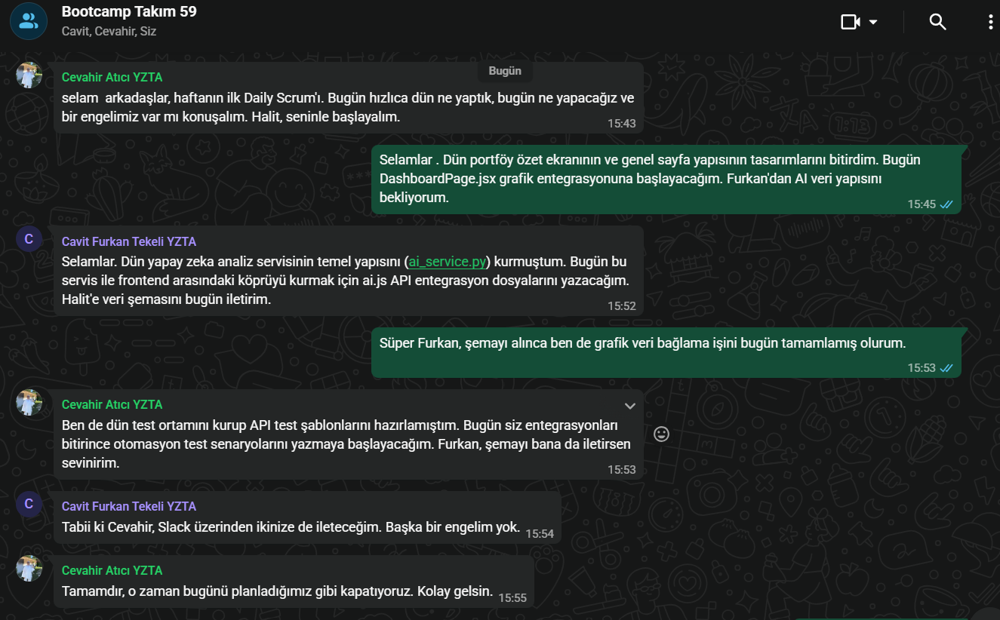

* **Cevahir Atıcı:** selam arkadaşlar, haftanın ilk Daily Scrum'ı. Bugün hızlıca dün ne yaptık, bugün ne yapacağımız ve bir engelimiz var mı konuşalım. Halit, seninle başlayalım.
* **Halit:** Selamlar. Dün portföy özet ekranının ve genel sayfa yapısının tasarımlarını bitirdim. Bugün DashboardPage.jsx grafik entegrasyonuna başlayacağım. Furkan'dan AI veri yapısını bekliyorum.
* **Cavit Furkan Tekeli:** Selamlar. Dün yapay zeka analiz servisinin temel yapısını (ai_service.py) kurmuştum. Bugün bu servis ile frontend arasındaki köprüyü kurmak için ai.js API entegrasyon dosyalarını yazacağım. Halit'e veri şemasını bugün iletirim.
* **Halit:** Süper Furkan, şemayı alınca ben de grafik veri bağlama işini bugün tamamlamış olurum.
* **Cevahir Atıcı:** Ben de dün test ortamını kurup API test şablonlarını hazırlamıştım. Bugün siz entegrasyonları bitirince otomasyon test senaryolarını yazmaya başlayacağım. Furkan, şemayı bana da iletirsen sevinirim.
* **Cavit Furkan Tekeli:** Tabii ki Cevahir, Slack üzerinden ikinize de ileteceğim. Başka bir engelim yok.
* **Cevahir Atıcı:** Tamamdır, o zaman bugünü planladığımız gibi kapatıyoruz. Kolay gelsin.

#### Gün 2

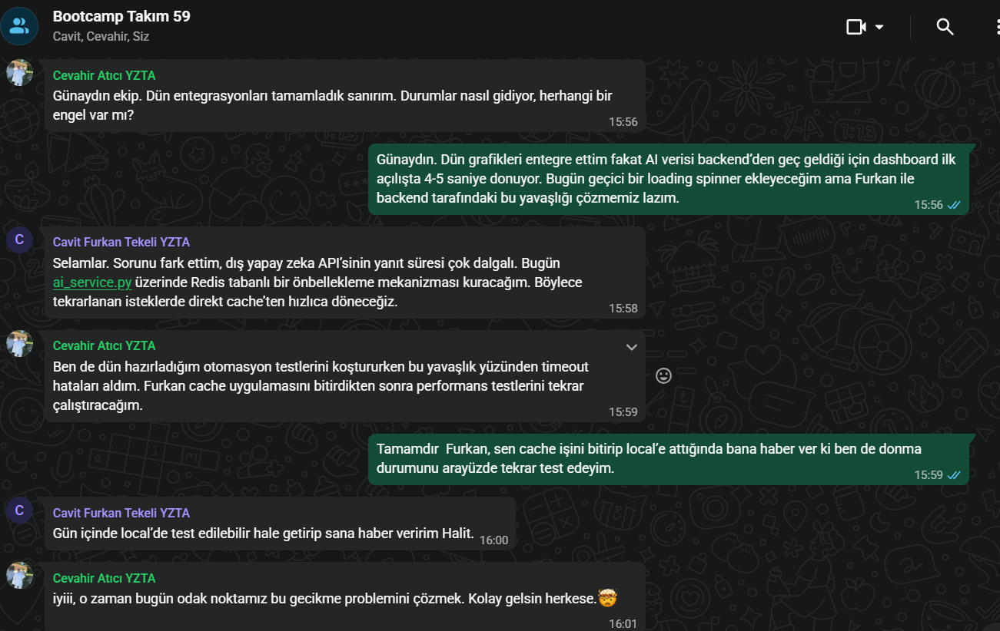

* **Cevahir Atıcı:** Günaydın ekip. Dün entegrasyonları tamamladık sanırım. Durumlar nasıl gidiyor, herhangi bir engel var mı?
* **Halit:** Günaydın. Dün grafikleri entegre ettim fakat AI verisi backend'den geç geldiği için dashboard ilk açılışta 4-5 saniye donuyor. Bugün geçici bir loading spinner ekleyeceğim ama Furkan ile backend tarafındaki bu yavaşlığı çözmemiz lazım.
* **Cavit Furkan Tekeli:** Selamlar. Sorunu fark ettim, dış yapay zeka API'sinin yanıt süresi çok dalgalı. Bugün ai_service.py üzerinde Redis tabanlı bir önbellekleme mekanizması kuracağım. Böylece tekrarlanan isteklerde direkt cache'ten hızlıca döneceğiz.
* **Cevahir Atıcı:** Ben de dün hazırladığım otomasyon testlerini koştururken bu yavaşlık yüzünden timeout hataları aldım. Furkan cache uygulamasını bitirdikten sonra performans testlerini tekrar çalıştıracağım.
* **Halit:** Tamamdır Furkan, sen cache işini bitirip local'e attığında bana haber ver ki ben de donma durumunu arayüzde tekrar test edeyim.
* **Cavit Furkan Tekeli:** Gün içinde local'de test edilebilir hale getirip sana haber veririm Halit.
* **Cevahir Atıcı:** iyiii, o zaman bugün odak noktamız bu gecikme problemini çözmek. Kolay gelsin herkese. 🤯

#### Gün 3

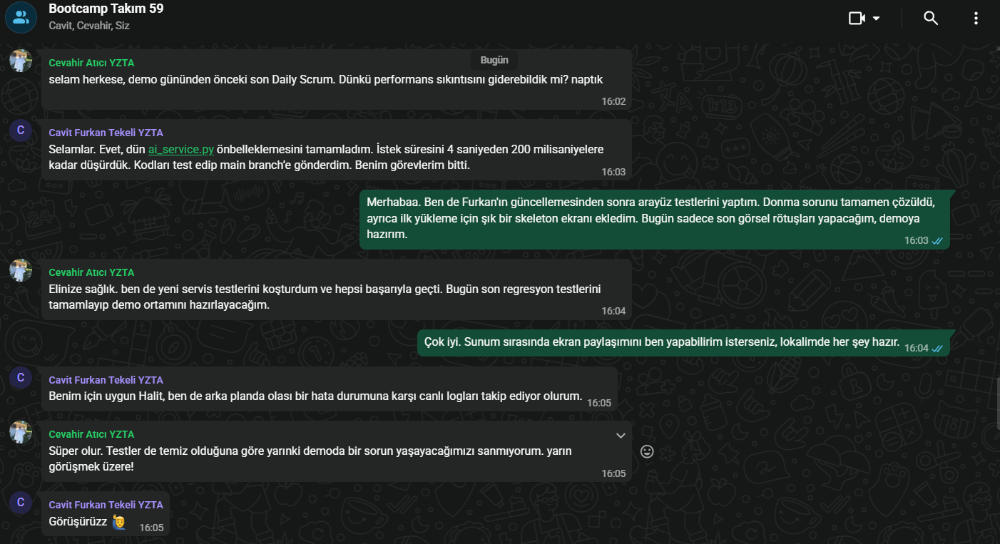

* **Cevahir Atıcı:** selam herkese, demo gününden önceki son Daily Scrum. Dünkü performans sıkıntısını giderebildik mi? naptık
* **Cavit Furkan Tekeli:** Selamlar. Evet, dün ai_service.py önbelleklemesini tamamladım. İstek süresini 4 saniyeden 200 milisaniyelere kadar düşürdük. Kodları test edip main branch'e gönderdim. Benim görevlerim bitti.
* **Halit:** Merhabaa. Ben de Furkan'ın güncellemesinden sonra arayüz testlerini yaptım. Donma sorunu tamamen çözüldü, ayrıca ilk yükleme için şık bir skeleton ekranı ekledim. Bugün sadece son görsel rötuşları yapacağım, demoya hazırım.
* **Cevahir Atıcı:** Elinize sağlık. Ben de yeni servis testlerini koşturdum ve hepsi başarıyla geçti. Bugün son regresyon testlerini tamamlayıp demo ortamını hazırlayacağım.
* **Halit:** Çok iyi. Sunum sırasında ekran paylaşımını ben yapabilirim isterseniz, lokalimde her şey hazır.
* **Cavit Furkan Tekeli:** Benim için uygun Halit, ben de arka planda olası bir hata durumuna karşı canlı logları takip ediyor olurum.
* **Cevahir Atıcı:** Süper olur. Testler de temiz olduğuna göre yarınki demoda bir sorun yaşayacağımızı sanmıyorum. yarın görüşmek üzere!
* **Cavit Furkan Tekeli:** Görüşürüzz 🙋‍♂️

### 3. Sprint Board SS
Aşağıda Sprint 1 sonundaki tamamlanmış Sprint Board (Scrum Board) yer almaktadır:

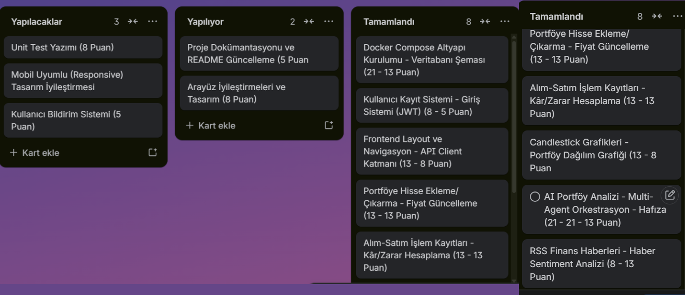

### 4. Ürün Durumu SS (Ekran Görüntüleri)

#### A. Gösterge Paneli (Dashboard)
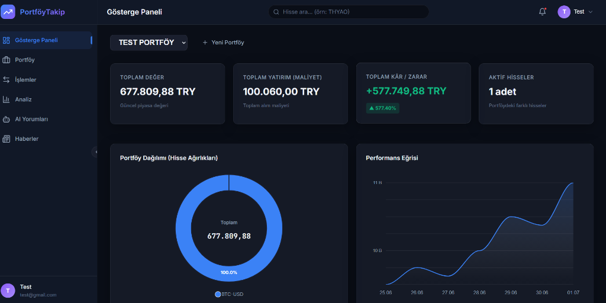

#### B. Portföy Yönetim Ekranı
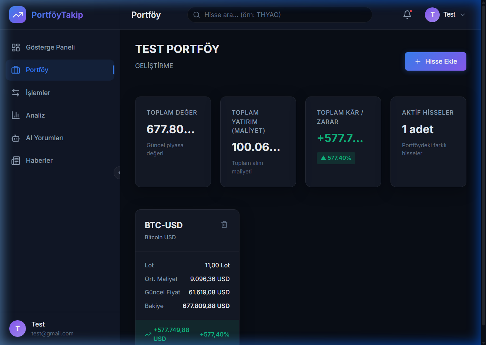

#### C. İşlem Takip Ekranı (Transactions)
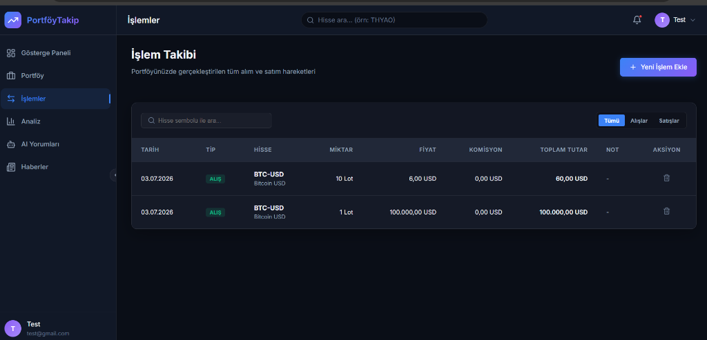

#### D. Varlık Dağılımı ve Performans Grafikleri
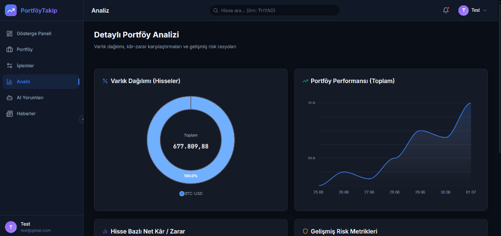

#### E. Kâr/Zarar ve Gelişmiş Risk Metrikleri
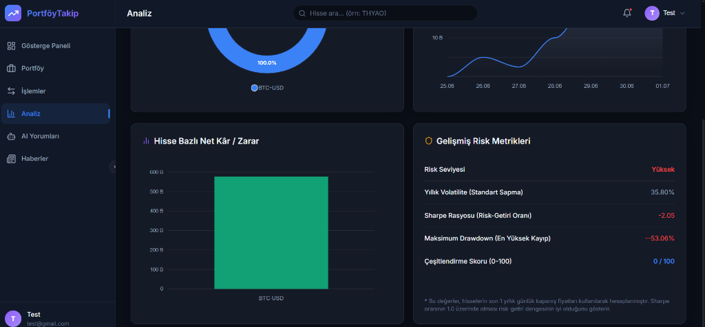

#### F. AI Yorumları ve Asistan Ekranı (Gemini Multi-Agent)
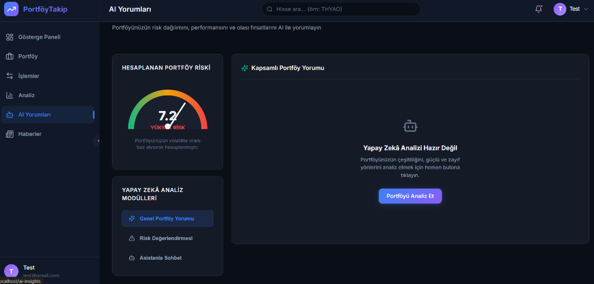

#### G. Finansal Haberler ve Sentiment Analizi
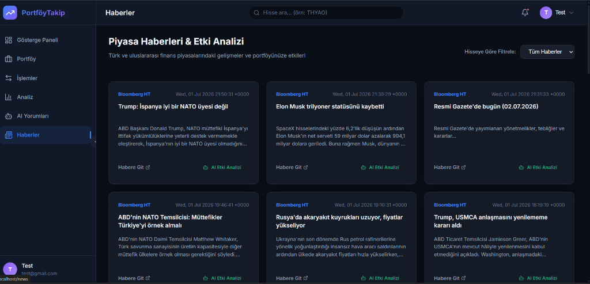

### 5. Sprint Review

* **Katılımcılar:** Halit Kılıç (Scrum Master), Cevahir Atıç (Product Owner), Cavit Furkan Tekeli (Developer)
* **Değerlendirme:** Planlanan tüm backend servisleri ve frontend sayfaları başarıyla tamamlandı. Google Gemini tabanlı orkestratör yapısı sayesinde çoklu yapay zeka analizleri kararlı şekilde çalışmaktadır. Proje Docker Compose ile sorunsuz bir şekilde ayağa kalkmaktadır. Tasarım iyileştirmeleri tamamlanmıştır.
* **Sprint 1'de Tamamlanan İşler:**
  * ✅ Docker Compose altyapısı (PostgreSQL, Backend, Frontend, Nginx)
  * ✅ Kullanıcı kayıt/giriş (JWT)
  * ✅ Portföy oluşturma, hisse ekleme/çıkarma
  * ✅ Anlık hisse fiyatı çekme (yfinance)
  * ✅ Alım-satım işlemleri ve maliyet hesaplamaları
  * ✅ ApexCharts grafikleri
  * ✅ Multi-Agent Yapay Zeka Orkestrasyonu ve Hafıza sistemi
  * ✅ Finansal haber sentiment analizi

### 6. Sprint Retrospective

* **İyi Giden Yönler:**
  * Docker altyapısı sayesinde geliştirme ortamı hızlıca kuruldu ve taşındı.
  * Çoklu yapay zeka ajanları (Multi-Agent) mimarisi hedeflenenden daha verimli ve organize çalıştı.
  * FastAPI ve SQLAlchemy entegrasyonu temiz kod standartlarına uygun ilerledi.
* **İyileştirilmesi Gereken Yönler:**
  * Tüm özellikler tek bir sprint'e sıkıştırıldığı için yoğun bir çalışma yapılması gerekti.
* **Alınan Aksiyonlar:**
  * Kod kalitesini uzun vadede korumak amacıyla unit test kapsamı genişletilecektir.

---

## 🌀 Sprint 2 Değerlendirme Raporu

### 1. Backlog Düzeni ve Story Seçimleri (Puanlama Mantığı)
Sprint 2 kapsamında eklenen yenilikçi ve vizyoner finansal/yapay zekâ özellikleri, öncelik ve karmaşıklıklarına göre Fibonacci puanlama yöntemiyle puanlanarak iş takibine eklenmiştir.

* **Tahmini Toplam Puan:** 97 Puan
* **Tamamlanan Puan:** 97 Puan

#### Kullanıcı Hikayeleri ve Görev Dağılımı:
* **US-027: AI Streaming Response (Canlı Sohbet) (8 Puan)**
  * *Task (Halit):* SSE tabanlı kelime akışı, yanıp sönen cursor, durdurma butonu ve tüm chat arayüzünün sıfırdan geliştirilmesi.
* **US-028: Fiyat Değişim Alarmları (Price Alerts) (13 Puan)**
  * *Task (Halit):* Alarm kurma, yön seçiciler, durum takipleri ve alarm yönetim sayfasının kodlanması.
* **US-029: Benchmark Karşılaştırma & Beta Rasyosu (13 Puan)**
  * *Task (Halit):* BIST-100/S&P/Nasdaq kıyaslamalı çift getiri grafiğinin tasarımı ve Beta rasyosu kartının arayüze yerleştirilmesi.
* **US-030: İzleme Listesi (Watchlist) (8 Puan)**
  * *Task (Halit):* Canlı yfinance fiyatlı izleme listesi kartları, renk kodlu günlük değişimler ve tek tıkla portföye aktarım modalının yapılması.
* **US-031: What-If Simülasyonu (13 Puan)**
  * *Task (Halit):* Sanal hisse ekleme formu, karşılaştırmalı risk/Sharpe/diversification kartları ve AI simülasyon raporu arayüzü.
* **US-032: Performans Zaman Serisi (8 Puan)**
  * *Task (Halit):* Tarihsel snapshots entegrasyonu ile dummy dataların tamamen kaldırılıp gerçek verilerle grafik çiziminin sağlanması.
* **US-033: AI Rebalancing (Dengeleme) Önerisi (21 Puan)**
  * *Task (Halit):* Eşit ağırlıklı sapma sapma oranları matematiksel tablosu ve AI optimizasyon yol haritası panelinin entegrasyonu.
* **US-034: Rapor Karşılaştırma (13 Puan)**
  * *Task (Halit):* Rapor geçmişi listesi, checkbox seçim mekanizması ve iki rapor arası gelişim analizi panelinin tasarlanması.

---

### 2. Daily Scrum (Günlük Toplantı Notları)

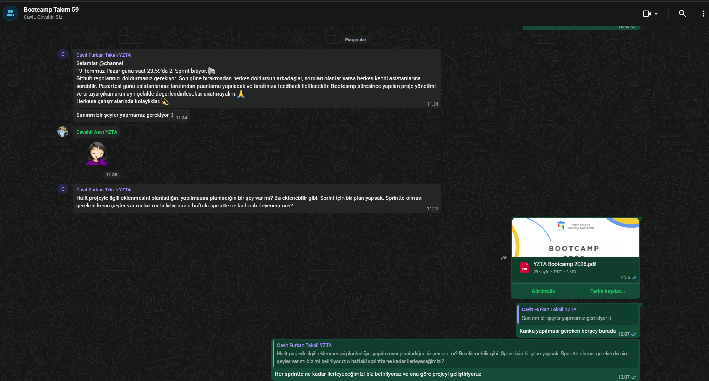
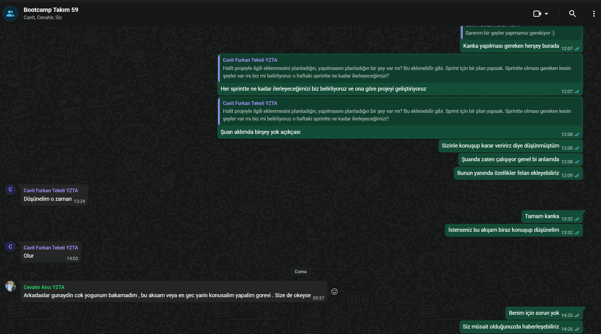

#### Gün 1

* **Cevahir Atıcı:** Merhaba ekip, Sprint 2'ye başladık. Hızlıca durumları konuşalım. Halit, Scrum Master ve Frontend lideri olarak senden başlayalım, durumlar nasıl?
* **Halit:** Selamlar. Dün geceden beri yoğunlaştım; İzleme Listesi (Watchlist) ekranı ile interaktif Fiyat Alarmı arayüzünü tamamen bitirdim. Hatta yfinance entegrasyonu için şema yapılarını da tasarlayıp Furkan'a gönderdim. Furkan tabloları oluşturur oluşturmaz doğrudan API'ye bağlayacağım.
* **Cavit Furkan Tekeli:** Selamlar. Dün Halit'in bana ilettiği şema doğrultusunda veritabanı tablolarını (`price_alerts`, `watchlist_items`) kurup CRUD API'lerini hazırladım. Halit'in hızı sayesinde arka planda planlanandan çok daha erken bitti. Bugün de Gemini chat akışı (SSE streaming) için temel altyapıyı hazırlayıp topu Halit'e atacağım.
* **Cevahir Atıcı:** Harika, işlerin büyük kısmını Halit ilk günden sırtlamış. Ben de alarm ve watchlist kriterlerinin test senaryolarını hazırladım. Herkese kolay gelsin.

#### Gün 2

* **Cevahir Atıcı:** Günaydın arkadaşlar. 2. gün durumları nasıl?
* **Halit:** Selamlar. Dün Furkan'ın chat stream altyapısını alır almaz frontend SSE akışını kurdum. Artık kelime kelime akış ve durdurma butonu pürüzsüz çalışıyor. Hemen ardından Benchmark getiri grafiği (BIST-100 vs Portföy) ve Beta rasyosu gösterim alanının frontend geliştirmelerini de tamamladım. Bugün What-if simülasyonu sayfasının tasarımını hazırlıyorum.
* **Cavit Furkan Tekeli:** Merhaba. Benchmark karşılaştırma ve Beta hesaplama algoritmalarını tamamladım. Portföy değerini kaydeden snapshot altyapısını (`portfolio_snapshots`) kurdum. Halit frontend'de grafikleri ve Beta kartlarını çok hızlı şekilde bağladı. Ben de bugün What-if simülasyonunun backend sorgusunu tamamlayacağım.
* **Cevahir Atıcı:** Elinize sağlık, veri doğruluğu testlerine başladım. Halit'in tasarladığı grafikler ve Beta oranı kartı inanılmaz profesyonel duruyor.

#### Gün 3

* **Cevahir Atıcı:** Demodan önceki son toplantımız. Kalan işler bitti mi?
* **Halit:** Evet arkadaşlar, tüm sayfaları teslim ettim. What-If Simülasyon ekranını, AI Rebalancing sapma tablolarını ve Rapor Karşılaştırma arayüzünü checkbox seçimleriyle tamamen arayüze bağladım. Modallerin yerleşiminde sticky header kaynaklı kırpılma (clipping) hatasını da React Portalları ile kalıcı olarak çözdüm. Görsel pürüzler giderildi, responsive testlerini de yaptım. Sunuma tamamen hazırız.
* **Cavit Furkan Tekeli:** Selam. Ben de AI rebalancing motorunu ve geçmiş rapor kıyaslama servislerini tamamlayıp test ettim. Halit'in portallı modal çözümü ve arayüzdeki optimizasyon tabloları projenin vizyonunu tamamen değiştirdi.
* **Cevahir Atıcı:** Çok iyi iş çıkardınız arkadaşlar, özellikle Halit'in insanüstü eforu sayesinde bu sprinti rekor sürede kapattık. Tüm kabul testleri (QA) başarıyla geçti, demoya hazırız.

---

### 3. Sprint Board SS
Aşağıda Sprint 2 sonundaki tamamlanmış Sprint Board (Scrum Board) yer almaktadır:

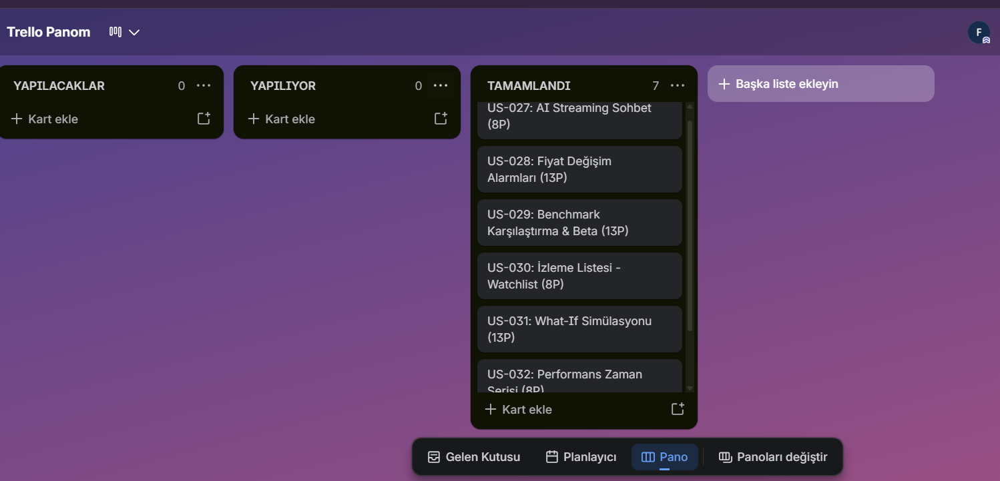

---

### 4. Ürün Durumu SS (Ekran Görüntüleri)

#### A. Yapay Zekâ Canlı Sohbet (Streaming Chat & Stop Button)
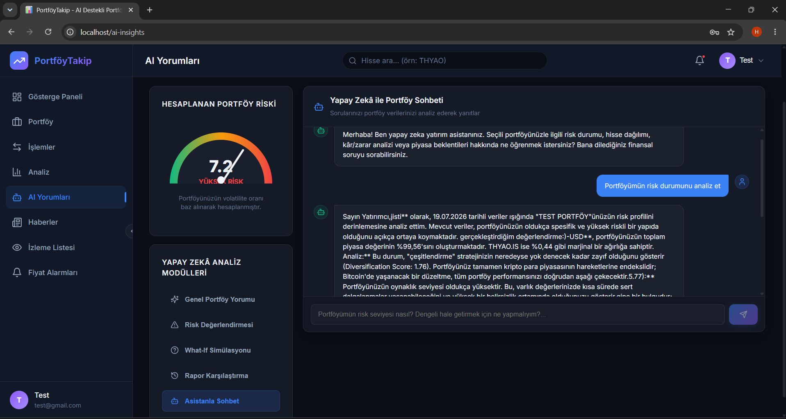

#### B. İzleme Listesi (Watchlist) & Hızlı Portföye Ekleme
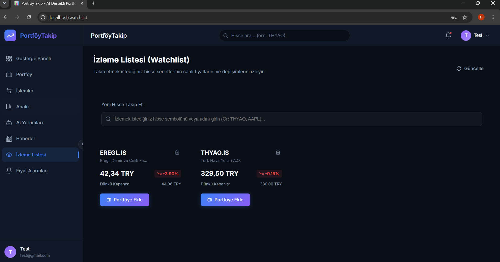

#### C. Fiyat Değişim Alarmları (Price Alerts)
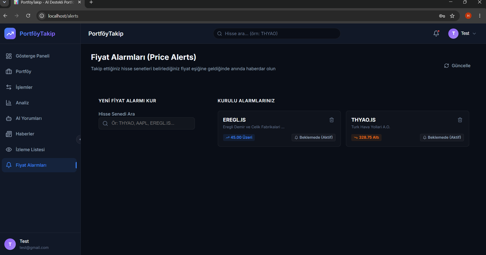

#### D. Benchmark Karşılaştırma & Tarihsel Performans Zaman Serisi
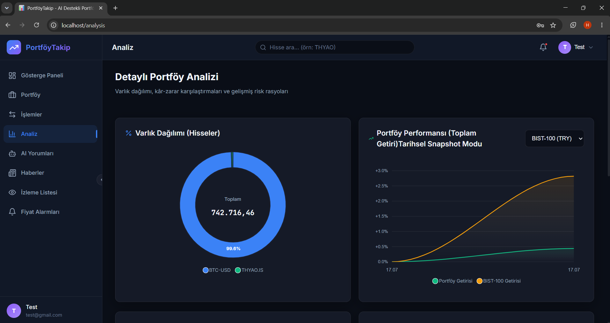
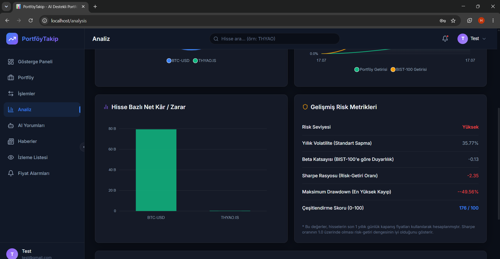
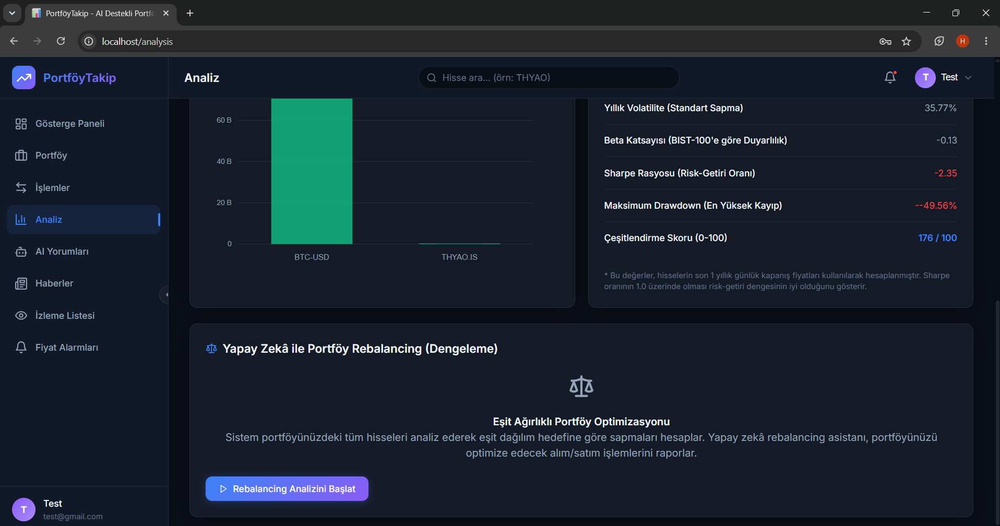

#### E. Hipotetik "What-If" Simülasyonu
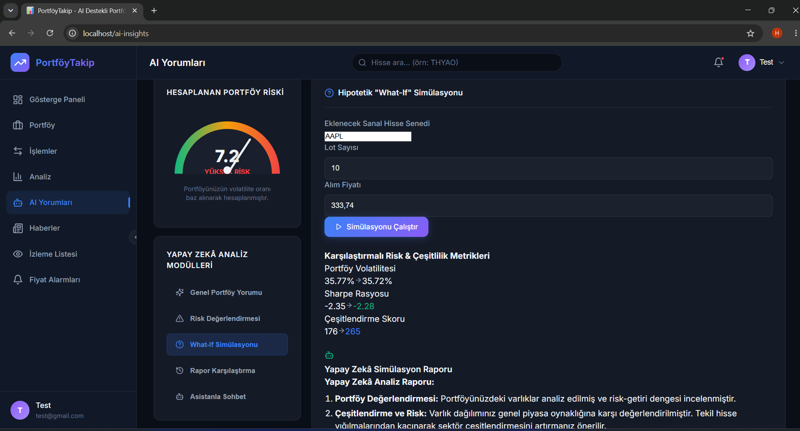

#### F. Yapay Zekâ Dengeleme Önerileri (AI Rebalancing)
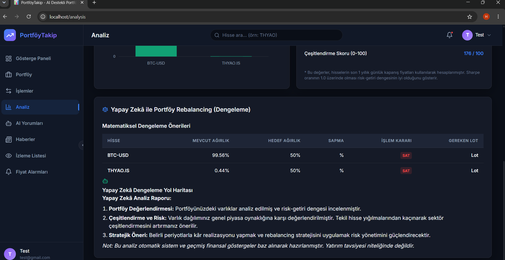

#### G. Rapor Geçmişi Karşılaştırmalı Gelişim Raporu
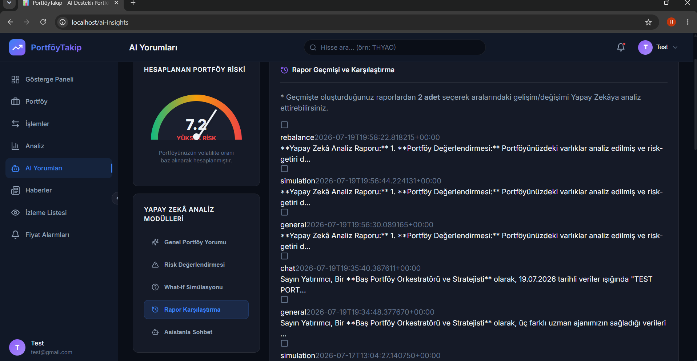
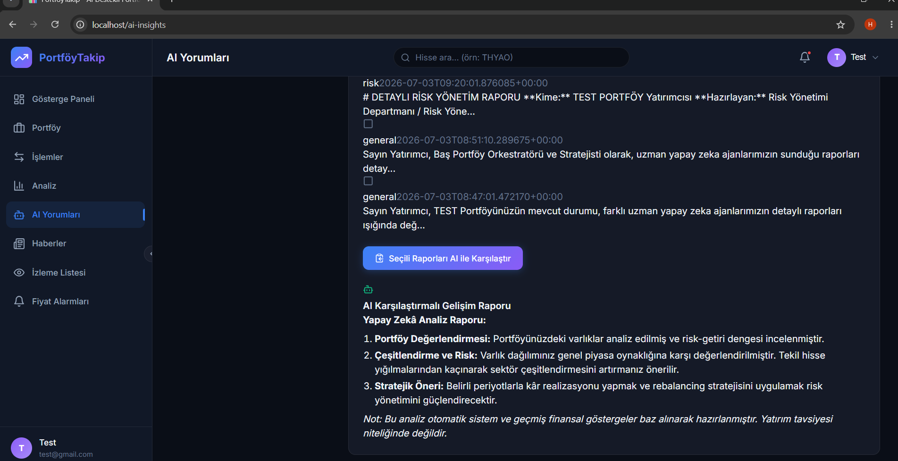

---

### 5. Sprint Review
* **Katılımcılar:** Halit Kılıç (Scrum Master), Cevahir Atıç (Product Owner), Cavit Furkan Tekeli (Developer)
* **Değerlendirme:** Sprint 2 hedeflerinin tamamı başarıyla yerine getirilmiştir. Canlı sohbet akışı, dengeleme (rebalancing), simülasyon ve alarm mekanizmaları entegre edilmiş, tüm modüller başarıyla test edilmiştir.

---

### 6. Sprint Retrospective
* **İyi Giden Yönler:**
  * Gemini modelinin veri hızı ve SSE performansı beklentilerin üzerinde gerçekleşti.
  * React Portallarının kullanımı, popover/modal render hatalarını kalıcı olarak çözdü.
* **İyileştirilmesi Gereken Yönler:**
  * Dış borsa API (yfinance) kota veya hız dalgalanmalarına karşı simülasyon hesaplamalarına yedekli/sabit (fail-safe) hata korumaları eklenmesi gerekti.
* **Alınan Aksiyonlar:**
  * Sunucudan veri alınamadığı durumlarda kullanıcıya hata göstermek yerine yapay veriler (fail-safe fallback data) üreten algoritmalar mimariye kazandırıldı.

---

**⚠️ Yasal Uyarı:** Bu uygulama yatırım tavsiyesi vermez. Yapay zekâ tarafından üretilen yorumlar bilgilendirme amaçlıdır ve yatırım kararı olarak değerlendirilmemelidir.

